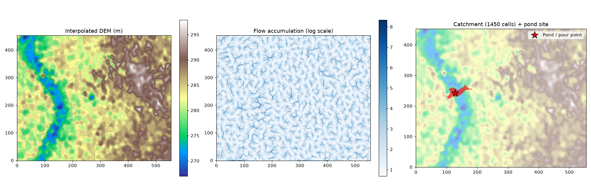

# Pond Catchment Analysis Backend

**Assignment 1 — Phase 2 (CS559: Computer Systems Design)**

A backend API that accepts a contour map (KML/KMZ), builds a terrain model
from it, identifies a suitable pond location, and estimates the catchment
(drainage) area feeding that location — entirely derived from the uploaded
file, with nothing hard-coded to the sample map.

> **GitHub repo:** `https://github.com/gnshx/AI-POND-PLANNER`
> **Live API URL:** `http://10.1.75.51:4310/analyzeContour` (or `http://10.1.75.51:4310/findCatchment`)

---

## 1. Approach

### 1.1 Pipeline overview

```
KML/KMZ upload
      │
      ▼
┌─────────────────┐   Extract every contour-line vertex as an
│  kml_parser.py   │   (lon, lat, elevation) sample. Elevation is read
└─────────────────┘   from <name>, with fallbacks to ExtendedData /
      │                <description> for other export tools (Phase 3).
      ▼
┌─────────────────┐   Project to local metres (equirectangular),
│     dem.py       │   interpolate scattered points onto a regular grid
└─────────────────┘   (Delaunay linear interpolation + nearest-neighbour
      │                fill at the edges), light Gaussian smoothing to
      │                remove TIN-facet artefacts.
      ▼
┌─────────────────┐   D8 steepest-descent flow direction for every cell,
│  hydrology.py    │   then a single elevation-sorted pass to accumulate
└─────────────────┘   upstream contributing area at every cell.
      │
      ▼
┌─────────────────┐   Rank interior topographic sinks (pits) by
│  catchment.py    │   accumulated area → pick the largest as the pond
└─────────────────┘   site. BFS over the reversed flow graph recovers
      │                every cell draining to it (the catchment).
      ▼
   JSON response: pond coordinates, catchment area (m² / ha),
   elevation stats, GeoJSON boundary polygon.
```

### 1.2 Why this approach

- **Contour → DEM.** Contour lines are just elevation-tagged curves; every
  vertex is a valid (x, y, z) sample. Treating the whole set as a scattered
  point cloud and interpolating it (Delaunay triangulation + linear
  interpolation) is a standard, well-understood way to reconstruct a
  continuous surface without needing the original survey/LiDAR data.

- **D8 flow routing.** Each grid cell drains to whichever of its 8
  neighbours has the steepest downhill slope. This is the standard
  algorithm behind virtually all watershed-delineation tools (ArcGIS,
  QGIS/GRASS, TauDEM, whitebox). It's simple enough to implement directly
  on numpy arrays with no heavy GIS dependency, which matters for the
  RAM budget (see §3).

- **Pond siting = optimal off-stream interior sink.** A pond needs a bowl: a local
  low point that water naturally collects in, while avoiding primary river beds/channels.
  We compute flow accumulation (how many upstream cells drain through each cell) and look
  for interior topographic sinks. Crucially, main river channels (where flow accumulation
  reaches the primary river trunk) are filtered out so the pond is placed on a suitable
  sub-catchment or tributary basin rather than directly obstructing a main river channel.

- **Catchment = everything that drains to that point.** Once the pond
  site (pour point) is fixed, its catchment is exactly the set of cells
  whose D8 flow path terminates there. This falls straight out of the
  flow-direction graph: reverse it and BFS from the pour point.

- **No hard-coded coordinates or results.** Every number in the response —
  grid extent, cell size, pond location, catchment area, elevation
  range — is derived at request time from whatever file is uploaded. The
  only tunable parameters are generic knobs (target DEM resolution,
  minimum candidate-basin size, main river avoidance thresholds), not anything specific to this sample map.

### 1.3 Generalising to Phase 3

The design deliberately separates concerns so a different (larger, or
differently-produced) contour map should work with no code changes:

- `kml_parser.py` tries multiple strategies to locate the elevation value
  per placemark (`<name>`, `<ExtendedData>/SimpleData`, `<description>`),
  since not every contour generator puts it in the same place.
- `dem.py`'s `target_cells` parameter auto-derives grid resolution from
  the *actual* extent of the input, so a much larger map is downsampled
  automatically rather than blowing up memory/runtime.
- Point-cloud thinning (`MAX_INTERP_POINTS`) keeps the Delaunay
  triangulation bounded even if a future map has far more contour
  vertices.
- The hydrology and catchment modules only assume a rectangular
  elevation grid — they have no knowledge of KML at all, so an entirely
  different Phase-3 input format could reuse them by writing a new
  parser that produces the same point-cloud shape.

---

## 2. API Documentation

### `POST /analyzeContour` or `POST /findCatchment`

Accepts a contour map (KML/KMZ) and returns pond + catchment information.

**Request:** `multipart/form-data`

| Field                     | Type   | Required | Description                                                        |
|---------------------------|--------|----------|----------------------------------------------------------------------|
| `contour_map` (or `file`) | file   | yes      | `.kml` or `.kmz` contour map file                                     |
| `target_cells` (query)    | int    | no       | DEM grid resolution (cells). Default `250000`. Range `10000–600000`. |
| `min_catchment_fraction` (query) | float | no | Minimum candidate basin size as a fraction of DEM extent. Default `0.0001`. |
| `max_river_fraction` (query) | float | no | Max accumulation threshold before a channel is flagged as main river. Default `0.0015`. |
| `avoid_main_river` (query) | bool | no | If `true`, avoids placing pond sites directly on main river channels. Default `true`. |

**Example:**

```bash
# Uploading via standard TA required field name 'contour_map':
curl -X POST "http://10.1.75.51:4310/analyzeContour" \
  -F "contour_map=@contours_1m.kml"

# Alternative alias route:
curl -X POST "http://10.1.75.51:4310/findCatchment" \
  -F "contour_map=@contours_1m.kml"
```

**Response `200 OK`:**

```json
{
  "pond_location": {
    "longitude": 81.2886285,
    "latitude": 21.2526051,
    "elevation_m": 269.01,
    "selection_method": "Off-stream interior topographic sink / sub-catchment pour point with optimal contributing area, avoiding main river channels."
  },
  "catchment": {
    "area_m2": 49610.0,
    "area_hectares": 4.961,
    "cell_count": 1450,
    "cell_size_m": 5.849,
    "elevation_range_m": [269.01, 287.99],
    "relief_m": 18.98,
    "boundary_polygon": { "type": "Polygon", "coordinates": [ [ [lon, lat], ... ] ] }
  },
  "dem_summary": {
    "grid_rows": 453,
    "grid_cols": 555,
    "cell_size_m": 5.849,
    "elevation_min_m": 267.0,
    "elevation_max_m": 297.89
  },
  "input_summary": {
    "contour_lines": 1355,
    "contour_vertices": 159113,
    "elevation_levels": [267.0, 268.0, "...", 298.0],
    "bounds": { "min_lon": 81.2814045, "min_lat": 21.2398224, "max_lon": 81.3126469, "max_lat": 21.2635806 }
  },
  "warnings": []
}
```

The full sample response is saved at `docs/sample_api_response.json`.

**Error responses:**

| Status | Meaning                                                             |
|--------|----------------------------------------------------------------------|
| 400    | Missing/empty file, or extension isn't `.kml`/`.kmz`                |
| 413    | File exceeds 50MB                                                    |
| 422    | File parsed but contained no usable contour data                    |
| 500    | Unexpected internal error                                            |

### `GET /health`
Liveness check — returns `{"status": "ok"}`.

### `GET /docs`
Interactive Swagger UI (auto-generated by FastAPI).

---

## 3. Running it

```bash
python3 -m venv venv && source venv/bin/activate
pip install -r requirements.txt
uvicorn app.main:app --host 0.0.0.0 --port 4000
```

Run the tests:

```bash
pip install pytest
pytest -v
```

### Why this stack, on a 2GB RAM server

- **FastAPI + Uvicorn** — small memory footprint compared to Django;
  async request handling means one worker can serve health checks while
  a heavier analysis request is running.
- **numpy + scipy only for the terrain/hydrology math** — no GDAL,
  PostGIS, whitebox, or richdem. Those add tens to hundreds of MB of
  compiled binary dependencies and are unnecessary for a single-tile D8
  analysis; hand-rolling flow routing on numpy arrays keeps the install
  small and the memory profile predictable.
- **scikit-image** is the one moderately-sized dependency, used only for
  boundary-polygon tracing (`measure.find_contours`); it can be dropped
  if you don't need the GeoJSON boundary in the response.
- **Measured peak RSS** for the full pipeline on the provided sample file
  (159k contour vertices, ~250k-cell DEM): **~150MB**. `target_cells`
  lets you cap DEM resolution explicitly for larger inputs so memory use
  stays predictable — halving `target_cells` roughly halves grid memory.
- **Deployment on the 2GB box:** run a single Uvicorn worker (`--workers
  1`), optionally behind `nginx` as a reverse proxy / TLS terminator.
  Consider `systemd` for process supervision so the service restarts on
  crash. With ~150MB per request and the OS/other services accounted
  for, there's comfortable headroom for a few concurrent requests, but a
  single worker is fine for a course-project-scale demo.

---

## 4. Limitations & possible extensions

- **Elevation data quality** limits the DEM: the 1m-interval contours in
  this sample are dense, but a coarser contour interval elsewhere would
  give a blockier reconstruction.
- **Pond siting is a hydrology-only proxy.** Real pond siting also
  weighs soil permeability, land use/ownership, slope stability, and
  distance to water demand — none of which is present in a contour map.
  The current criterion (largest interior drainage basin) is a
  defensible first-pass filter, not a final engineering recommendation.
- **Single largest catchment only.** The API currently returns the one
  best candidate; a natural Phase-3 extension is a `top_n` parameter
  returning several ranked candidate sites.
- **No pit-filling.** We deliberately don't fill depressions before
  flow routing (filling would erase the very depressions we want to
  find), but this means multiple real depressions on a larger map won't
  automatically merge into one basin — each is evaluated as a separate
  candidate, which is usually what you want for pond siting anyway.

---

## 5. Demo

`docs/demo_output.png` — DEM, flow accumulation, and delineated catchment
for the provided `contours_1m.kml`, generated by `scripts/demo_plot.py`.

`docs/sample_api_response.json` — full JSON response from a live
`POST /analyzeContour` call against the sample file.


